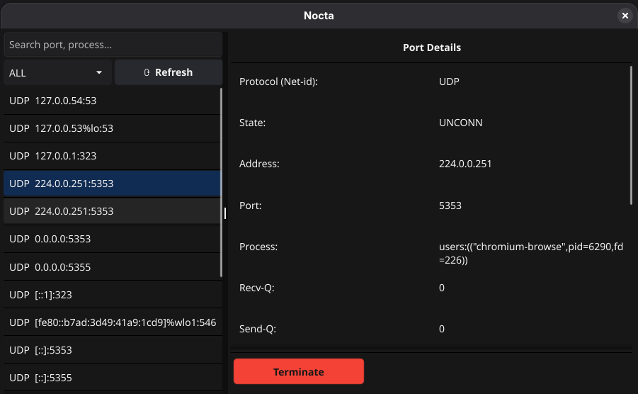

## Nocta

A lightweight GUI application for monitoring and managing open ports on your system.
Replace repetitive terminal commands like `ss`, `netstat`, or `lsof`.

## Installation

You can install Nocta by downloading the latest release tarball:

1. Download the tar file:

```bash
wget https://github.com/yofabr/nocta/releases/download/v1.0.0/nocta.tar.xz
```

2. Extract the archive:

```bash
tar -xf nocta.tar.xz
```

3. Run the installer

```bash
make install
```

3. Enter the extracted directory and run the application:

```bash
cd nocta
./nocta
```

> Note: Make sure the `nocta` file is executable. If not, run `chmod +x nocta`.

## Screenshot



---
