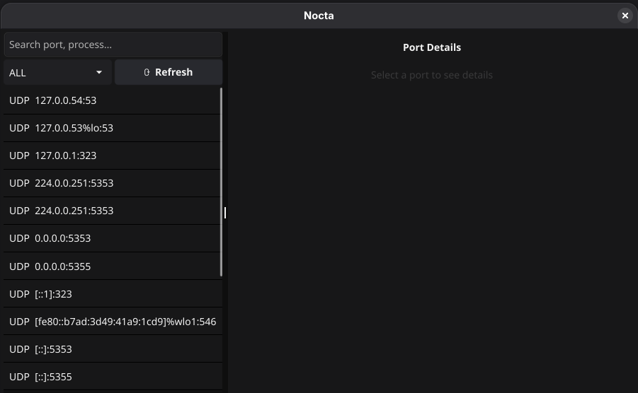
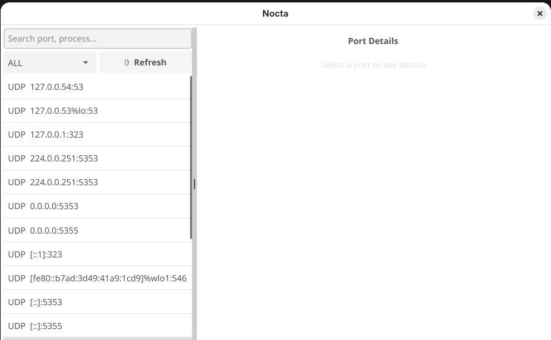

  

<h1 align="center">Nocta</h1>

  A lightweight GUI application for monitoring and managing open ports on your system.

---

## What is Nocta?

**Nocta** is a simple, fast, and user-friendly **port monitoring GUI app**.  
It helps developers quickly see which ports are open, what services are running, their uptime and detect potential conflicts without living in the terminal.

## Screenshot

## Use Cases

- Detect port conflicts during development
- Replace repetitive terminal commands like `ss`, `netstat`, or `lsof`

## Installation

> Coming soon…

---

## Tech Stack

- **Language:** Go
- **GUI:** Fyne
- **Platform:** Linux (more coming)

---