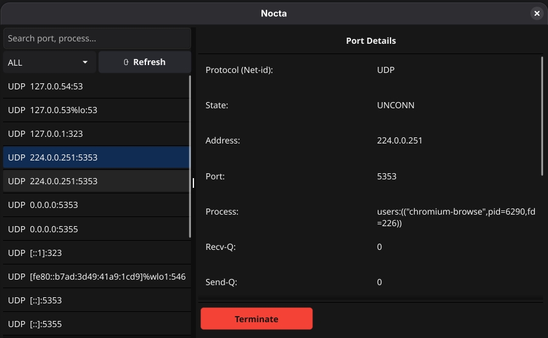

## Nocta

A lightweight desktop GUI for monitoring and managing open ports on your system—without jumping between repetitive `ss`, `netstat`, or `lsof` commands.

## Features

- **Real-time Port Monitoring** for TCP/UDP listeners and connections
- **Process Details** to quickly identify what owns each port
- **Port Management** to terminate related processes when needed
- **Search & Filter** by port, process name, and protocol
- **Configurable Behavior** via YAML config file
- **Data Export** to CSV and JSON
- **Cross-platform** (Linux, macOS, Windows) via Fyne

## Installation

### From Source

```bash
git clone https://github.com/yofabr/nocta.git
cd nocta
go build ./cmd/nocta
./nocta
```

### From Release (Coming Soon)

```bash
wget https://github.com/yofabr/nocta/releases/download/v1.0.0/nocta.tar.xz
tar -xf nocta.tar.xz
make install
cd nocta
./nocta
```

> If `nocta` is not executable, run: `chmod +x nocta`

## Configuration

Nocta reads configuration from:

`~/.config/nocta/config.yaml`

Default example:

```yaml
gui:
  width: 900
  height: 520
  split: 0.35
refresh:
  interval: 30
  auto: false
filter:
  default_protocol: ALL
  show_closed: false
notifications:
  enabled: false
  on_new: true
  on_close: true
```

## Usage

### 1) Launch Nocta

Run the application from your terminal:

```bash
./nocta
```

### 2) Inspect active ports

On startup, Nocta loads currently active ports and process owners into the main table.

### 3) Narrow results quickly

- Use the **search field** to filter by port number or process name.
- Use the **protocol filter** to switch between TCP, UDP, or all.

### 4) Investigate and manage

- Select a row to review process and socket details.
- Use **Terminate** when available to stop a process bound to a port.

### 5) Keep data up to date

- Press **Refresh** for an immediate update.
- Enable **auto-refresh** in config if you want periodic updates.

## Screenshot



---

## Contributing

1. Fork the repository
2. Create a feature branch (`git checkout -b feature/amazing-feature`)
3. Commit your changes (`git commit -m 'Add some amazing feature'`)
4. Push to the branch (`git push origin feature/amazing-feature`)
5. Open a Pull Request

## License

This project is licensed under the MIT License - see the LICENSE file for details.
